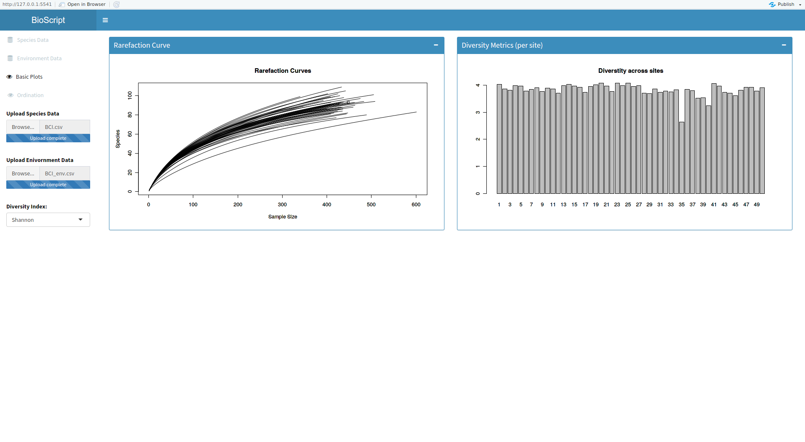
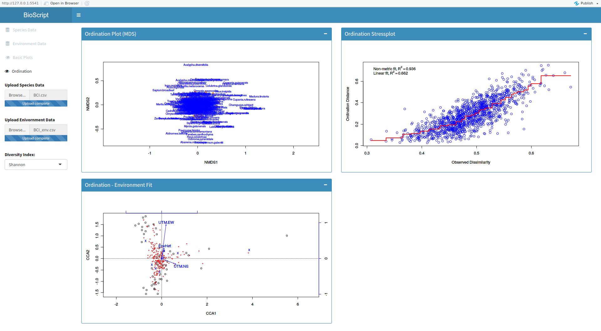
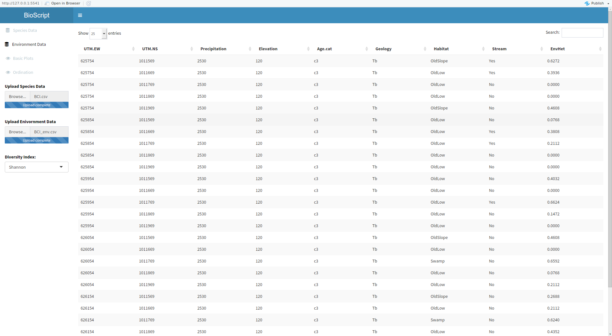
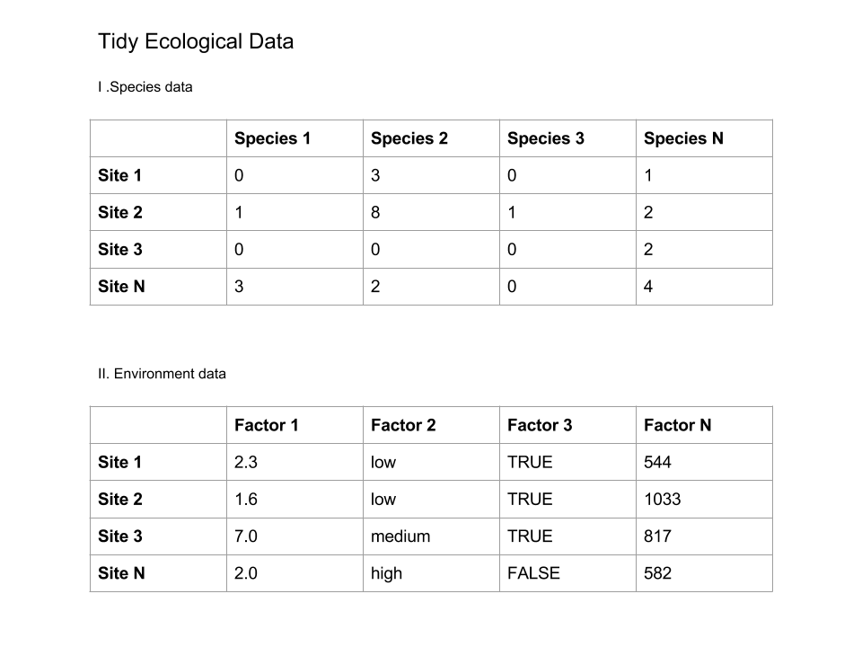

# Vegan GUI

This package a Graphical User Interface (GUI) for common community ecology functions from the [vegan]("https://cran.r-project.org/web/packages/vegan/index.html") package.

You can clone this repository and run the app locally, or you can use the `runGithub` function directly:

```r
library(shiny)
runGitHub("vegan_gui", "mltos")
```

Screenshots: (click to zoom):

General Plots         |  Basic Ordination
:-------------------------:|:-------------------------:
 |  
 |  


In order for the functionality to work you need to input the data in a [tidy](http://vita.had.co.nz/papers/tidy-data.html) format. Here is a schema how this looks like for species and environment data.


